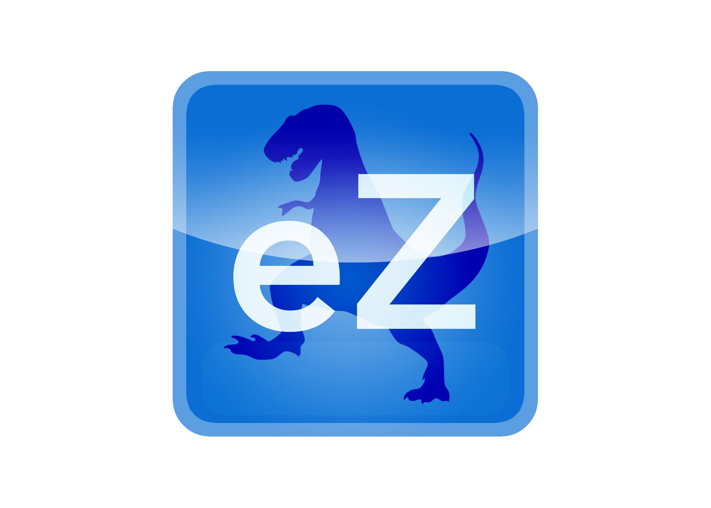

[eZ](https://itunes.apple.com/us/genre/ios/id36?mt=8) is an iOS application that provides users with a quick and easy way to search for movies and tv shows across 300+ streaming services. It utilizes React Native with a lightweight FireBase back-end, and a Flux architecture with a Redux state container to control the application state on the front-end.

eZ is a collaborative project by Alex Sherman, David Hu, and Tom Ogasawara.

## Features

- Simultaneous query over 300 streaming services
- Search from any page using an integrated search bar
- Create user accounts with secure authentication
- Access links to available streaming sites directly from the app

## Technology

### Frontend

Using the [Redux](https://github.com/reactjs/redux) implementation of the [Flux](https://facebook.github.io/flux/) design pattern, we set up actions, reducers, and a single store to manage data flow and to update the state of the application. We used [React Native](https://facebook.github.io/react-native/) to render an intuitive mobile UI by creating declarative React components, and styled them using React Native's integrated stylesheet system with pure JavaScript.

We used [npm](https://www.npmjs.com/) to manage all of the JavaScript packages, and the [Babel](https://babeljs.io/) transpiler to convert [ES6](https://en.wikipedia.org/wiki/ECMAScript#6th_Edition_-_ECMAScript_2015) to [ES5](https://en.wikipedia.org/wiki/ECMAScript#5th_Edition) and bundle it into a single file.

### Backend

We set up a lightweight back-end with secure user authentication using [FireBase](https://firebase.google.com/), and store user data in the [cloud](https://en.wikipedia.org/wiki/Cloud_storage) to ensure a consistent experience across different devices.

## Future Implementation

[development readme](docs/README.md)

[RESTful](https://en.wikipedia.org/wiki/Representational_state_transfer) [APIs](https://en.wikipedia.org/wiki/Application_programming_interface) that  performs [CRUD](https://en.wikipedia.org/wiki/Create,_read,_update_and_delete) operations

[JSON](http://www.json.org/).
